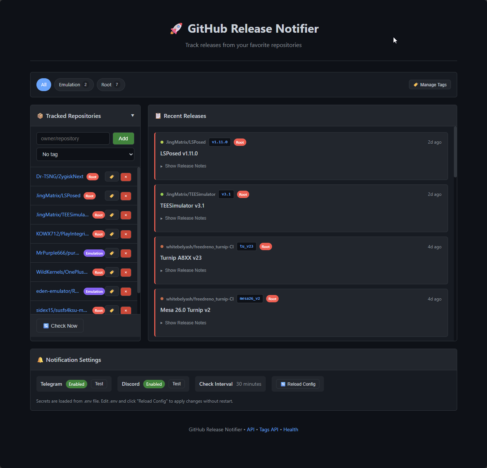

# GitHub Release Notifier

A lightweight, self-hosted application to track GitHub releases and get notified via Telegram or Discord. Perfect for running on a Raspberry Pi.



## Features

- 🔍 **Track any GitHub repository** - Add repos via the web UI
- 🔔 **Multiple notification channels** - Telegram and Discord support
- 🖥️ **Clean web interface** - View all releases in one place
- 🐳 **Docker-ready** - Easy deployment with docker-compose
- 🍓 **Raspberry Pi optimized** - Lightweight Python + SQLite stack
- ⚡ **Configurable check interval** - Balance between freshness and API limits

## Quick Start

### 1. Clone and Configure

```bash
git clone https://github.com/xD33m/gh-release-notifier.git
cd gh-release-notifier
```

Copy the example environment file and fill in your values:

```bash
cp .env.example .env
```

Edit `.env` with your settings:

```bash
# GitHub Personal Access Token (optional, for higher rate limits)
GITHUB_TOKEN=ghp_your_token_here

# Telegram notifications
TELEGRAM_BOT_TOKEN=123456:ABC-DEF...
TELEGRAM_CHAT_ID=123456789

# Discord notifications
DISCORD_WEBHOOK_URL=https://discord.com/api/webhooks/...

# Check interval in minutes (optional, default: 30)
CHECK_INTERVAL=30
```

### 2. Run with Docker Compose

```bash
docker-compose up -d
```

The app will be available at `http://localhost:8080`

### 3. Configure Traefik (Optional)

The `docker-compose.yml` includes Traefik labels. Update the host rule:

```yaml
- "traefik.http.routers.release-notifier.rule=Host(`releases.yourdomain.com`)"
```

## Configuration

### Environment Variables

All configuration is done via environment variables in the `.env` file:

| Variable              | Required | Description                          |
| --------------------- | -------- | ------------------------------------ |
| `GITHUB_TOKEN`        | No       | GitHub Personal Access Token         |
| `CHECK_INTERVAL`      | No       | Minutes between checks (default: 30) |
| `TELEGRAM_BOT_TOKEN`  | No\*     | Telegram bot token from @BotFather   |
| `TELEGRAM_CHAT_ID`    | No\*     | Your Telegram chat/group ID          |
| `DISCORD_WEBHOOK_URL` | No\*     | Discord webhook URL                  |

\*At least one notification method (Telegram or Discord) should be configured.

### Getting Notification Credentials

#### Telegram

1. Message [@BotFather](https://t.me/BotFather) and create a new bot
2. Copy the bot token
3. Message [@userinfobot](https://t.me/userinfobot) to get your chat ID
4. Start a conversation with your bot

#### Discord

1. Go to Server Settings → Integrations → Webhooks
2. Create a new webhook
3. Copy the webhook URL

#### GitHub Token (Optional but Recommended)

1. Go to [GitHub Settings → Tokens](https://github.com/settings/tokens)
2. Generate a new token (classic) with `public_repo` scope
3. Add to your `.env` file as `GITHUB_TOKEN`

## API Endpoints

| Endpoint         | Method | Description                      |
| ---------------- | ------ | -------------------------------- |
| `/`              | GET    | Web dashboard                    |
| `/api/releases`  | GET    | List recent releases (JSON)      |
| `/api/repos`     | GET    | List tracked repositories (JSON) |
| `/repos/add`     | POST   | Add a repository                 |
| `/repos/remove`  | POST   | Remove a repository              |
| `/check-now`     | POST   | Trigger immediate check          |
| `/test/telegram` | POST   | Test Telegram notification       |
| `/test/discord`  | POST   | Test Discord notification        |
| `/health`        | GET    | Health check                     |

## Architecture

```
┌─────────────────────────────────────────────────────────┐
│                    Docker Container                      │
│  ┌─────────────┐  ┌──────────────┐  ┌────────────────┐ │
│  │  FastAPI    │  │  APScheduler │  │  Notification  │ │
│  │  Web UI     │  │  (Background)│  │  Service       │ │
│  └─────────────┘  └──────────────┘  └────────────────┘ │
│         │                │                   │          │
│         └────────────────┼───────────────────┘          │
│                          │                              │
│                   ┌──────────────┐                      │
│                   │   SQLite DB  │                      │
│                   └──────────────┘                      │
└─────────────────────────────────────────────────────────┘
```

## Development

### Local Setup

```bash
# Create virtual environment

python -m venv venv
source venv/bin/activate # or `venv\Scripts\activate` on Windows

# Install dependencies
pip install -r requirements.txt

# Copy environment file
cp .env.example .env

# Run the application
uvicorn app.main:app --reload
```

### Project Structure

```
gh-release-notifier/
├── app/
│   ├── __init__.py
│   ├── main.py              # FastAPI application
│   ├── config.py            # Configuration management
│   ├── database.py          # SQLite database operations
│   ├── github_client.py     # GitHub API client
│   ├── scheduler.py         # Background job scheduler
│   ├── notifications/
│   │   ├── telegram.py      # Telegram notifications
│   │   └── discord.py       # Discord notifications
│   └── templates/
│       └── index.html       # Web UI template
├── assets/
│   └── img/
│       └── preview.png      # Dashboard preview image
├── static/
│   └── styles.css           # UI styling
├── .env.example             # Example environment file
├── Dockerfile
├── docker-compose.yml
└── requirements.txt
```

## License

MIT License
